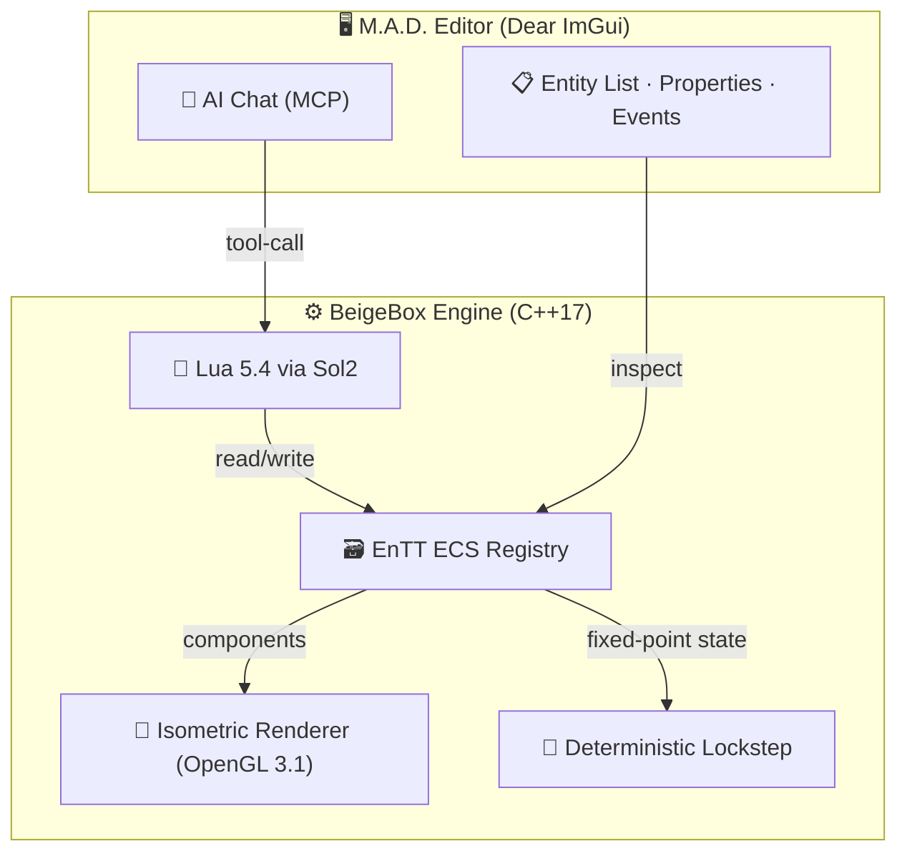

<p align="center">
  
  
  
  
</p>

# Project M.A.D. — BeigeBox Engine

> **"Runs on a potato. Built with AI. Forged in lockstep."**

A custom isometric RTS engine targeting **circa-2005 hardware** — Intel GMA 950, single-core CPUs, 512 MB RAM. Built in C++17 with a deterministic lockstep netcode, an embedded Lua scripting runtime, and an AI-assisted vibe-coding editor powered by the [Model Context Protocol (MCP)](https://modelcontextprotocol.io/).

Inspired by the genre-defining performance of *RollerCoaster Tycoon* (99% x86 assembly) and the elegant simplicity of *GameMaker*'s Event-Action system.

---

## 🧊 Architecture



| Layer | Technology | Why |
|-------|-----------|-----|
| **Language** | C++17 | Modern features, broad compiler support |
| **Windowing & Input** | SDL2 2.32 | Cross-platform, near-zero overhead |
| **Graphics** | OpenGL 3.1 / GLES 2.0 | Runs on Intel GMA X3100 (2007) and up |
| **ECS** | [EnTT](https://github.com/skypjack/entt) v3.15 | Cache-friendly contiguous storage — *RCT*-level memory locality |
| **Scripting** | Lua 5.4 via [Sol2](https://github.com/ThePhD/sol2) v3.5 | Sandboxed, fast, AI-writable |
| **Editor UI** | [Dear ImGui](https://github.com/ocornut/imgui) v1.91 (docking) | Single draw call, ~zero memory |
| **Netcode** | Deterministic Lockstep | Peer-to-peer, 8-player LAN, zero-float |
| **Math** | Q24.8 Fixed-Point | No floating-point in gameplay — guarantees cross-CPU sync |
| **AI Integration** | MCP Server | BYOK — OpenAI / Anthropic / Gemini / Ollama |

---

## 🔢 Deterministic Math

All gameplay logic uses **Q24.8 fixed-point integers** — no `float` or `double` ever touches a unit position, velocity, or health value.

| Property | Value |
|----------|-------|
| **Storage** | `int32_t` |
| **Integer bits** | 24 (range: ±8,388,607) |
| **Fractional bits** | 8 (precision: ~0.0039) |
| **Addition/Subtraction** | Native `+` / `-` (single cycle) |
| **Multiplication** | `int64_t` intermediate + bit-shift |
| **Division** | Shift-then-divide |
| **Sqrt** | Newton's method (integer-only, 4 iterations) |

Floating-point conversion occurs **only at the render boundary** — the OpenGL shader receives `float` values derived from `FixedPoint::ToFloat()`, ensuring gameplay remains 100% deterministic across all CPUs and compilers.

---

## 🧪 Lua API (Event-Action Model)

Scripts are attached to entities and triggered by engine events. The visual editor maps blocks to these exact functions.

### Event Hooks

| Event | Signature | Fires When |
|-------|-----------|------------|
| `OnInit` | `(entity_id)` | Entity created |
| `OnTick` | `(entity_id)` | Every logic frame (~30 Hz) |
| `OnRightClick` | `(entity_id, target_x, target_y, target_id)` | Player issues order |
| `OnTakeDamage` | `(entity_id, damage, attacker_id)` | Entity hit |
| `OnDeath` | `(entity_id)` | Entity destroyed |

### Transform API *(implemented)*

```lua
local x, y = Transform.GetPosition(entity_id)
Transform.SetPosition(entity_id, x_raw, y_raw)
local dist = Transform.GetDistance(e1, e2)  -- Manhattan, deterministic
```

### Example: Patrolling Driller Unit

```lua
function OnTick(entity_id)
    local x, y = Transform.GetPosition(entity_id)
    x = x + 8                    -- ~0.03 tiles/tick in Q24.8
    if x > 12 * 256 then x = 0 end
    Transform.SetPosition(entity_id, x, y)
end
```

> **Code-Locked:** Scripts using `for` loops, `pairs()`, or custom logic with no visual block equivalent are flagged as *Code-Locked* — the visual editor hides its blocks, and the user edits raw Lua or asks the AI to refactor.

---

## 🚀 Quick Start

### Prerequisites (Debian 13 Trixie)

```bash
sudo apt install build-essential cmake       \
                 libsdl2-dev liblua5.4-dev   \
                 libgl-dev git
```

### Build

```bash
git clone https://github.com/cpntodd/beigebox.git
cd beigebox
cmake -B build -DCMAKE_BUILD_TYPE=Debug
cmake --build build
```

### Run

```bash
# Standalone engine (isometric tile grid + ECS + Lua)
./build/engine/beigebox_runtime

# M.A.D. Editor (ImGui + AI chat)
./build/editor/mad_editor
```

### Test

```bash
cd build && ctest --output-on-failure
```

---

## 📁 Project Structure

```
BeigeBox/
├── engine/
│   ├── include/beigebox/
│   │   ├── core/          # fixed_point.h
│   │   ├── ecs/           # components.h (Transform, Health, Player...)
│   │   ├── render/        # renderer.h, isometric.h
│   │   └── lua/           # lua_bridge.h
│   └── src/
│       ├── main.cpp       # Runtime entry point
│       ├── core/          # fixed_point.cpp
│       ├── render/        # renderer.cpp, isometric.cpp
│       └── lua/           # lua_bridge.cpp (Sol2 bindings)
├── editor/
│   └── src/               # ImGui editor application
├── tools/
│   └── open-gs-maptool/   # Bundled map generation CLI
├── tests/                 # doctest unit + integration tests
├── assets/sprites/        # Sprite sheets
└── cmake/                 # Custom find modules (FindLua54.cmake)
```

---

## 📚 Research Citations & Inspirations

| Source | Contribution |
|--------|-------------|
| **Chris Sawyer, *RollerCoaster Tycoon*** (1999) | Proved that assembly-level performance is achievable in high-level languages via Data-Oriented Design and contiguous memory arrays. Our EnTT ECS mirrors RCT's peep array architecture. |
| **Mark Overmars, *GameMaker*** (1999–) | Established the Event-Action visual scripting paradigm. Our Lua API directly maps to this model — discrete, non-nesting action blocks tied to engine events. |
| **Westwood Studios, *C&C: Red Alert 2*** (2000) | Gold standard for deterministic lockstep netcode in isometric RTS. Our Q24.8 fixed-point math and peer-to-peer sync model follow RA2's proven architecture. |
| **Glenn Fiedler, *Gaffer On Games*** | [*"Deterministic Lockstep"*](https://gafferongames.com/post/deterministic_lockstep/) — foundational reference for lockstep implementation and fixed-point math in networked games. |
| **Chris Hecker, *Game Developer Magazine*** | [*"Fixed-Point Arithmetic"*](https://web.archive.org/web/20190412063600/http://www.d6.com/users/checker/pdfs/gdmfp.pdf) — established best practices for fixed-point math in games, directly informing our Q24.8 implementation. |
| **Michele Caini (skypjack), *EnTT*** | ["*ECS Back and Forth*"](https://skypjack.github.io/) — the contiguous storage model that gives us cache performance approaching hand-tuned assembly. |
| **Ocornut, *Dear ImGui*** | [*"Immediate Mode GUI"*](https://github.com/ocornut/imgui) — the paradigm that makes our VB6-style editor feasible with near-zero memory overhead. |

---

## 📄 License

This project is licensed under the **MIT License** — see [LICENSE](./LICENSE) for details.

Third-party libraries carry their own licenses:
- **EnTT** — MIT
- **Sol2** — MIT
- **Dear ImGui** — MIT
- **SDL2** — zlib
- **Lua 5.4** — MIT
- **doctest** — MIT

---

<p align="center">
  <sub>Built with ☕ on Debian Trixie · Target: Intel GMA 950 · 2005–∞</sub>
</p>
